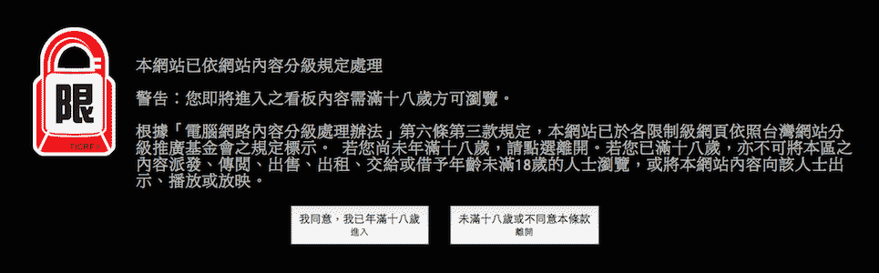

#PTT 自動分級確認

 [][License]

###我已滿 18 歲，請不要浪費我的時間

想好好看文章，卻被下面這個「電腦網路內容分級處理辦法」確認畫面搞的七葷八素？

讓 **PTT 自動分級確認**幫你省去載入的麻煩與網路流量。

###使用說明

安裝對應瀏覽器的附加元件即可。

###下載

- [Google Chrome][Chrome]
- [Mozilla Firefox][Firefox]
- [Apple Safari][Safari]

[Chrome]: https://chrome.google.com/webstore/detail/ptt-自動分級確認/ekegehhnkpbgocdjdlhnmjkkgdhgdheg
[Firefox]: https://addons.mozilla.org/en-US/firefox/addon/ptt-%E8%87%AA%E5%8B%95%E5%88%86%E7%B4%9A%E7%A2%BA%E8%AA%8D/
[Safari]: https://vox.vg/apps/ptt-18plus/ptt-18plus.safariextz

###版權聲明

詳見 [`LICENSE`][License] 檔案。

[License]: https://github.com/x43x61x69/PTT-18Plus/blob/master/LICENSE